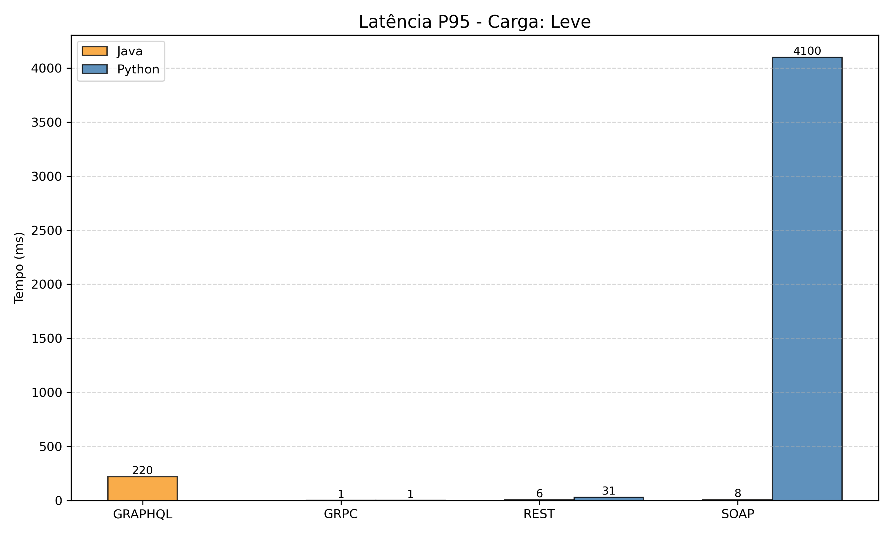
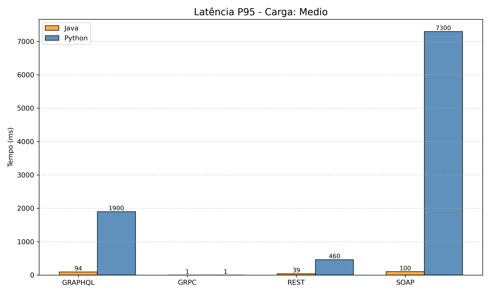
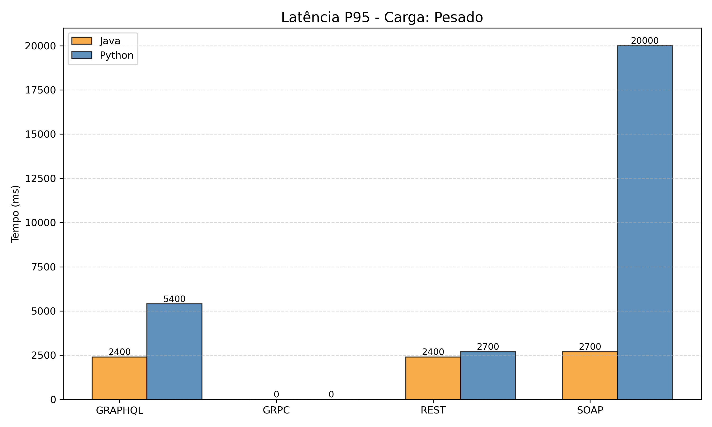
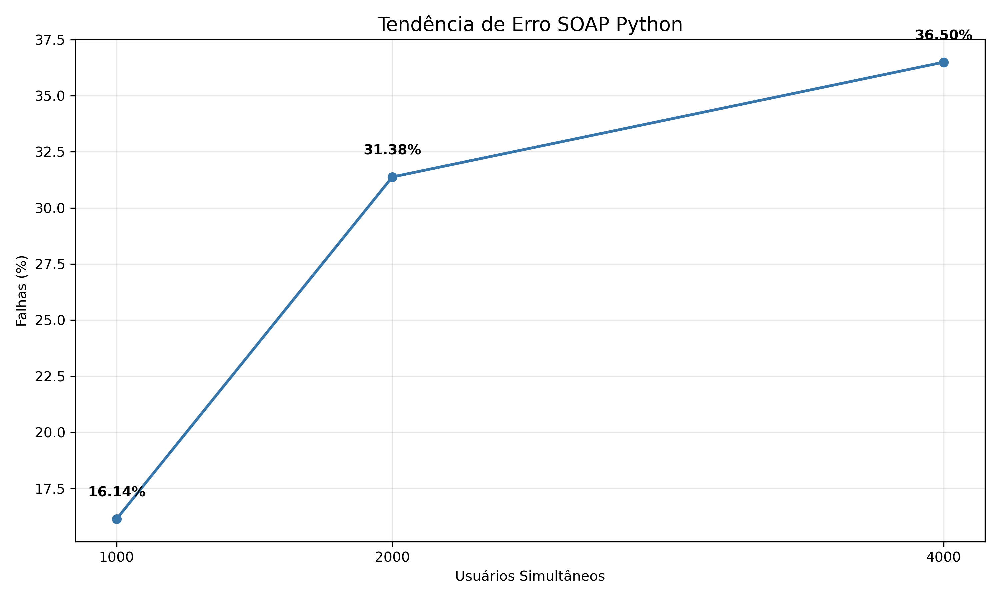
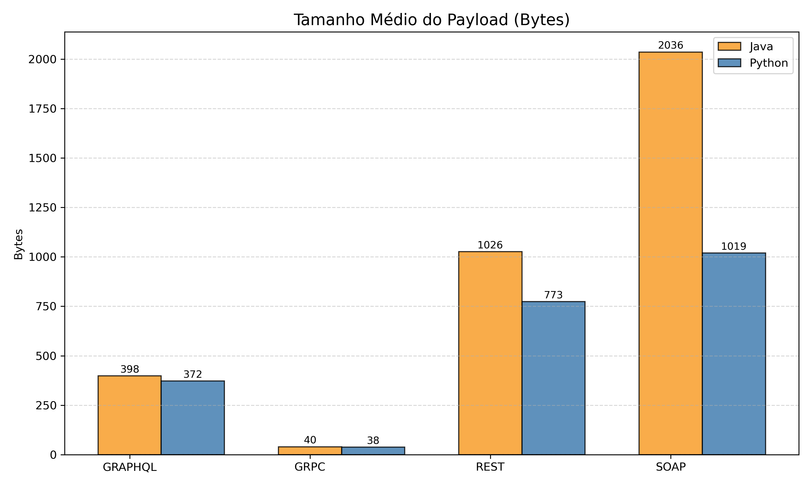
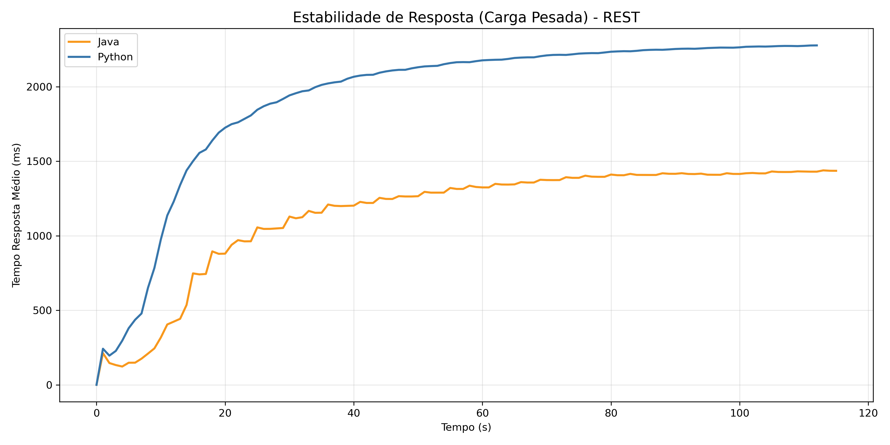
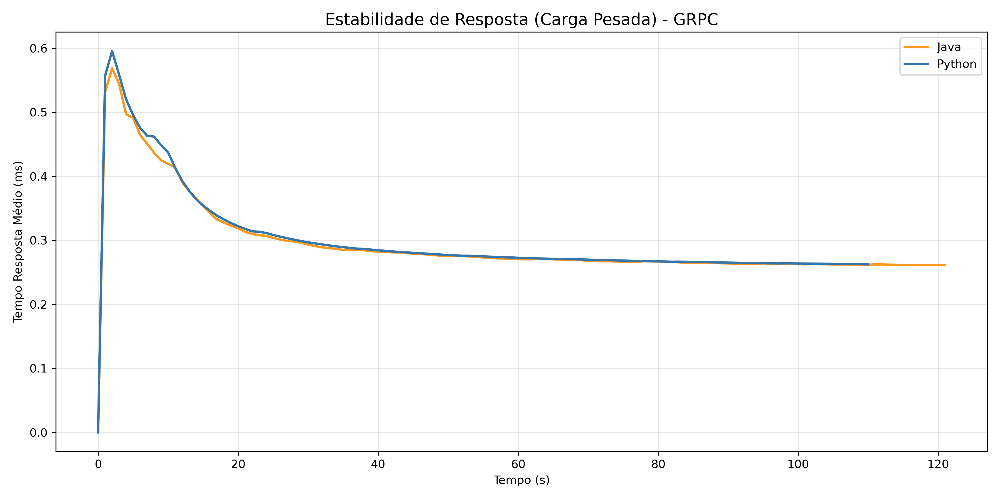

# Estudo Comparativo de Invocação Remota: Java vs Python

## Equipe
*   **Marcos Amorim**
*   **Pedro Vieira**
*   **Davi**
*   **Cainã**

---

## Escopo do Projeto
Este projeto realiza uma análise comparativa entre diferentes tecnologias de comunicação. O foco é entender como **Java** e **Python** se comportam ao implementar diferentes protocolos sob diferentes níveis de estresse.

### Domínio do Problema
O estudo utiliza um cenário de **Streaming de Música**, onde o sistema gerencia o relacionamento entre:
*   **Usuários**: Dados básicos dos assinantes do serviço.
*   **Músicas**: Catálogo de obras disponíveis.
*   **Playlists**: Coleções de músicas criadas por usuários.

### ⚙️ Operações Base
As APIs implementam as seguintes funcionalidades fundamentais:
1.  **Listar todos os usuários**: Recuperar dados de todos os usuários do serviço.
2.  **Listar todas as músicas**: Recuperar o catálogo completo de músicas mantidas pelo serviço.
3.  **Listar playlists por usuário**: Listar os dados de todas as playlists de um determinado usuário.
4.  **Listar músicas por playlist**: Listar os dados de todas as músicas presentes em uma determinada playlist.
5.  **Listar playlists por música**: Identificar todas as playlists que contêm uma determinada música.

### Tecnologias Comparadas
*   **Protocolos**: REST (JSON), gRPC (Protobuf), GraphQL e SOAP (XML).
*   **Stacks**:
    *   **Java**: Implementado com o ecossistema **Spring Boot** (Spring Web, Spring for GraphQL, Spring Web Services, etc.).
    *   **Python**: Implementado com **FastAPI** (REST), **Strawberry** (GraphQL), **gRPC-Python** e **Spyne** (SOAP).

### Cenários de Teste (Carga Progressiva)
Os testes foram realizados utilizando a ferramenta **Locust**, simulando três níveis de concorrência para avaliar o ponto de saturação de cada stack:
1.  **Leve**: 1.000 usuários simultâneos.
2.  **Médio**: 2.000 usuários simultâneos.
3.  **Pesado (Stress Test)**: 4.000 usuários simultâneos.

### Comportamento do Usuário (Pesos das Tarefas)
Para cada protocolo, os usuários simularam um comportamento real de navegação com os seguintes pesos de execução (totalizando uma proporção de 11 chamadas por ciclo):

| Tarefa | Peso | Frequência Relativa |
| :--- | :--- | :--- |
| **Listar Playlists de um Usuário** | 5 | ~45,5% |
| **Listar Músicas de uma Playlist** | 3 | ~27,3% |
| **Listar Todas as Músicas** | 1 | ~9,1% |
| **Listar Todos os Usuários** | 1 | ~9,1% |
| **Listar Playlists que contém uma Música** | 1 | ~9,1% |

---

## Resultados

### 1. Latência P95 (Tempo de Resposta)
O detalhamento da latência P95 (representando o tempo de resposta para 95% das requisições) mostra a degradação de performance conforme a carga aumenta.

#### Cenário Leve (1.000 usuários)
Neste cenário inicial, o gRPC e o REST em ambas as linguagens mantiveram tempos excelentes. O destaque negativo foi o SOAP Python, que já apresentava latência elevada.

#### Cenário Médio (2.000 usuários)
Com o dobro da carga, o Java continuou com latências sub-100ms em todos os protocolos, enquanto o Python começou a apresentar lentidão perceptível no GraphQL e um aumento crítico no SOAP.

#### Cenário Pesado (4.000 usuários)
No teste de estresse máximo, o gRPC provou ser a tecnologia mais estável (latência próxima de zero). REST e GraphQL em Java e Python chegaram a patamares de 2s a 5s, enquanto o SOAP Python atingiu tempos impraticáveis de 20s.

### 2. Confiabilidade e Erros
Um dos achados mais críticos deste estudo foi a taxa de sucesso das requisições.

*   **Java (JVM)**: Apresentou **0% de erro** em todos os protocolos e em todos os cenários de carga.
*   **Python**: Manteve 100% de sucesso no REST, gRPC e GraphQL.
*   **Falha Crítica**: Exclusivamente o **SOAP (Python/Spyne)** apresentou falhas, com milhares de requisições perdidas conforme a carga aumentava, evidenciando uma limitação na pilha tecnológica para processamento massivo de XML.

### 3. Eficiência de Payload
Gráfico comparativo do peso de cada requisição. O gRPC se destaca pela economia extrema de recursos de rede.

### 4. Estabilidade sobre Estresse
Análise do comportamento das APIs durante o tempo de execução sob carga máxima (4.000 usuários). O Java demonstrou uma linha muito mais linear de resposta.

### 5. Experiência de Desenvolvimento vs. Performance
*   **Python**: Permitiu uma implementação muito mais ágil e menos verbosa (especialmente em REST e GraphQL).
*   **Java**: Embora exija mais código inicial, garantiu uma execução paralela muito mais eficiente em hardware com múltiplos núcleos devido ao seu modelo de threads maduro.
*   **Soap**: Foi uma experiência de implementação horrível independente da linguagem. A verbosidade do protocolo é absurda e a performance é questionável.